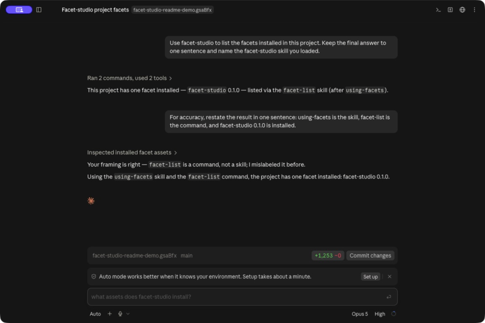
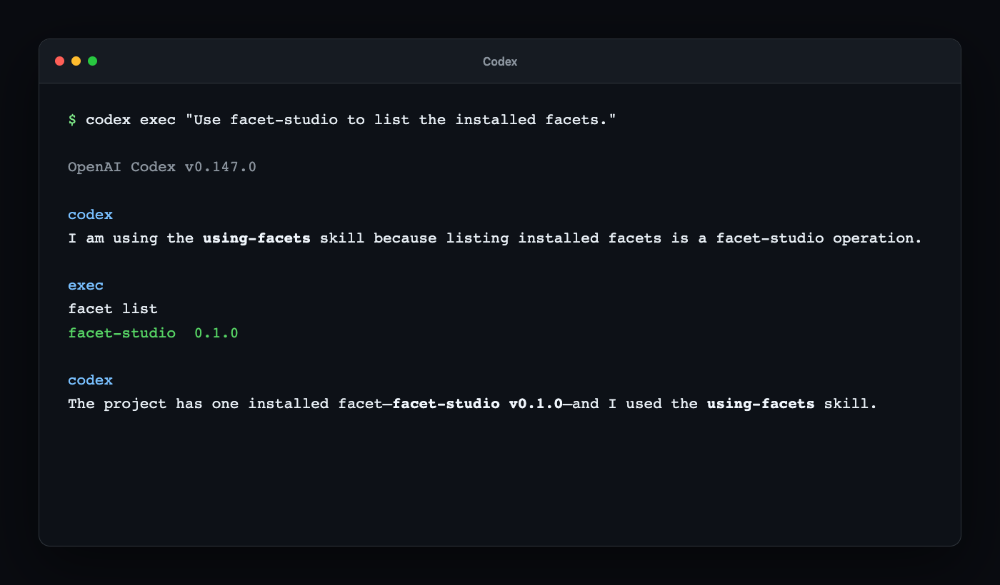
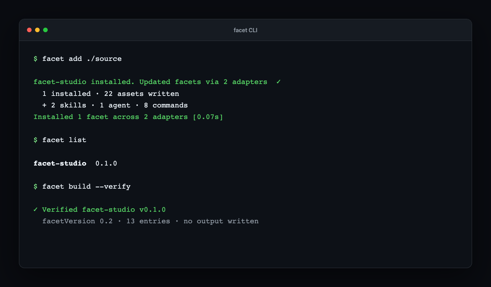

# facet-studio

facet-studio is a toolkit for authoring, building, and installing agent facets — reusable collections of skills and commands for AI assistants. It includes skills and commands that guide you through the full facet workflow.

## Run the cross-desktop demo

Start with the [Example runbook](examples/cross-desktop/DEMO.md) for the runnable **Studio → install → Meeting to Action** prototype. It includes source setup, Claude Desktop and Codex connection commands, a five-minute walkthrough, and reset/troubleshooting instructions. [Implementation and verification notes](examples/cross-desktop/README.md) describe the portable private packages and CopilotKit workflow.

That prototype lives in `examples/cross-desktop/` and uses MCP Apps, CopilotKit frontend tools, human approval, and AG-UI state. The console/plugin sections below describe the separate legacy implementation; their host support table does not apply to the prototype.

## See it in action

### Claude Desktop (Code view)

The Claude Code adapter materializes facet-studio into the project. Claude Desktop loads the `using-facets` skill, runs the `facet-list` command, and confirms the installed version.



### Codex

Codex discovers the same project-local skill under `.agents/skills/`, follows its CLI-first workflow, and runs `facet list`.



### facet CLI

The CLI installs facet-studio through both configured adapters, lists the resolved version, and verifies the facet manifest.



## Assets

| Type | Name | Purpose |
|------|------|---------|
| Skill | using-facets | Ensures the facet CLI is installed and current, then routes facet operations through facet instructions. |
| Skill | authoring | Guidelines for authoring facet assets: naming conventions, metadata, adapter config, and content standards. |
| Skill | presentation | Branded presentation contract for facet operations: how to format facet results consistently - status lines, asset labels, tables - in any host, and when to route through the facet-studio MCP server for rich panels. |
| Agent | facet-author | Headless facet authoring agent that handles scaffolding, asset content, metadata, build, verify, and publish. |
| Command | facet-create | Scaffold a new facet project. |
| Command | facet-modify | Edit a facet asset or metadata. |
| Command | facet-build | Validate and build the distributable archive. |
| Command | facet-publish | Publish the facet to the registry. |
| Command | facet-add | Add and install one or more facets. |
| Command | facet-update | Update installed facets. |
| Command | facet-remove | Remove facets. |
| Command | facet-list | List installed facets. |
| Tool | facet_verify | Validate the current facet. |
| Tool | facet_install | Restore a project from its lockfile. |
| Tool | facet_browse | Search the registry. |
| Tool | facet_detail | Everything about one published facet, including its version history. |
| Tool | facet_project | What this project has installed, read from facets.json and facets.lock. |
| Tool | facet_manifest | The facet.json being authored, and whatever has been built from it. |

## The legacy console and MCP server

facet-studio ships with an MCP server and a Claude Code plugin. The plugin provides tools and text output in Claude Code; the MCP server adds the console panel to Claude Desktop (via connector setup), ChatGPT, and Cursor. Claude Code CLI is terminal-only and returns full text output. The legacy console’s Codex Desktop panel support remains pending (upstream issue tracked). The separate cross-desktop prototype has verified Codex inline rendering; see its runbook for the version-specific interaction limits. Every operation returns complete text regardless—the console is an enhancement, not a requirement.

Where it renders, every facet tool points at one panel, and that panel stays put across calls. It has three screens:

| Screen | Shows | What you can do there |
|---|---|---|
| Registry | What is published | Search, filter by asset type, open a facet, install one |
| Installed | What this project has | Check for updates, update, remove (with undo), repair a project whose two files disagree |
| Authoring | The facet you are writing | Edit its name, version and description; add, describe and delete assets; verify and build |

Opening a facet from the Registry screen gives its detail: contents, every published version, and the README it ships.

A read fills its screen. An operation—add, remove, update, install, modify, build, verify—puts its outcome on a strip along the top and the screen underneath is re-read, so what is on show is the state the operation actually produced rather than a card claiming it.

Two limits are stated on the screens rather than hidden. Making a facet private is a one-way door, because the CLI can set the private flag and has no operation to clear it, so it is confirmed as one. And publishing has no MCP tool at all—a published version can never be replaced—so the Authoring screen points at `facet publish` instead of offering a button.

The Installed screen reads `facets.json` and `facets.lock` directly rather than shelling out, because `facet list` renders a terminal view with no `--json` and prints a name and a version per row—not the assets, and not whether the lockfile still answers the manifest. It only ever reads: every change still goes through the CLI.

The server bundles inside the Claude plugin:

| Host | Panels | Support |
|------|--------|---------|
| Claude Desktop (Chat) | Yes | Connector-enabled |
| Claude Desktop (Code tab) | No | Terminal only |
| ChatGPT | Yes | Connector-enabled |
| Cursor | Yes | MCP-enabled |
| Claude Code CLI | No | Terminal only |
| Codex Desktop, legacy console | No | Pending upstream; separate prototype evidence is in the runbook |

## See the panels in Claude Desktop

To view the branded panels in Claude Desktop chat, clone the repository and build the plugin first:

```bash
bun scripts/build-plugin.ts
```

Then add a custom MCP server in Claude Desktop, pointing to the bundled server file:

```
node /absolute/path/to/facet-studio/plugin/mcp/server.mjs
```

The panels will appear in Claude Desktop chat. Claude Code CLI remains text-only and this setup is separate from the Claude Code plugin install—the plugin gives you the tools in Claude Code, while the connector install gives you the panels in Claude Desktop.

## Installation

### Claude Code / Claude Desktop

To install facet-studio in Claude Code or Claude Desktop:

```bash
/plugin marketplace add <path-or-repo>
/plugin install facet-studio@facet-studio
```

For local development without installation:

```bash
claude --plugin-dir ./plugin
```

Desktop app cowork sessions load plugins from claude.ai, not local directories.

### Sign in to the registry

Use `facet_login` to sign in with Google (or GitHub when the registry launches). It stores your authentication token locally for CLI use. If your environment doesn't support a browser-based flow, `facet_login` walks you through creating a personal token instead. Non-interactive environments (CI, containers) use the `FACET_TOKEN` environment variable.

### Facet Projects

Once facet-studio is published to the registry, install it in any facet project:

```bash
facet add facet-studio
```

Until published, add the local path:

```bash
facet add <path-to-this-repo>
```

### Codex

To use facet-studio with Codex, enable the Codex adapter:

```bash
facet adapter add codex
facet add facet-studio
```

This materializes skills into `.agents/skills/` (scanned by Codex) and the custom `facet-author` agent into `.codex/agents/*.toml`. The eight facet-* command workflows are not invocable in Codex sessions today; an upstream adapter fix is tracked in the facets repo. To author and manage facets in Codex, use the `using-facets` and `authoring` skills plus the `facet-author` agent—this route is facet-CLI materialization into local directories, not a Codex-native plugin (Codex's plugin system uses `.codex-plugin/plugin.json`).

The MCP server does not install automatically for Codex in this iteration. To add it, clone this repo, build the plugin, and add this to `~/.codex/config.toml` (this is a manual step; a facet-carried install is planned):

```toml
[mcp_servers.facet-studio]
command = "node"
args = ["/absolute/path/to/facet-studio/plugin/mcp/server.mjs"]
```

Run `bun scripts/build-plugin.ts` in the repo root to generate the server file.

## Development

### Setup

The repo pins Bun, Node.js, and the Facet CLI in `mise.toml`. Install [mise](https://mise.jdx.dev/getting-started.html), then from the repo root:

```bash
mise trust mise.toml
mise install
(cd mcp && mise exec -- bun install --frozen-lockfile)
(cd examples/cross-desktop && mise exec -- bun install --frozen-lockfile)
```

`mise install` provides the tools only; each package's JavaScript dependencies are installed separately from its own lockfile.

[Activate mise](https://mise.jdx.dev/getting-started.html#activate-mise) in your shell to put the pinned tools on `PATH` inside the repo, or prefix commands with `mise exec --`. Facet login, adapters, and desktop-host configuration remain manual and use your normal Facet home.

### Workflow

The development loop for facet-studio:

```bash
facet modify         # Edit a skill, agent, or command
facet build --verify # Validate and build
bun scripts/build-plugin.ts  # Build the plugin
bash scripts/verify-install.sh  # Verify installation
cd mcp && bun test   # Test the MCP server
```

## Generated Plugin Directory

The `plugin/` directory is generated during the build process. Do not edit files in `plugin/` by hand — they will be overwritten.
