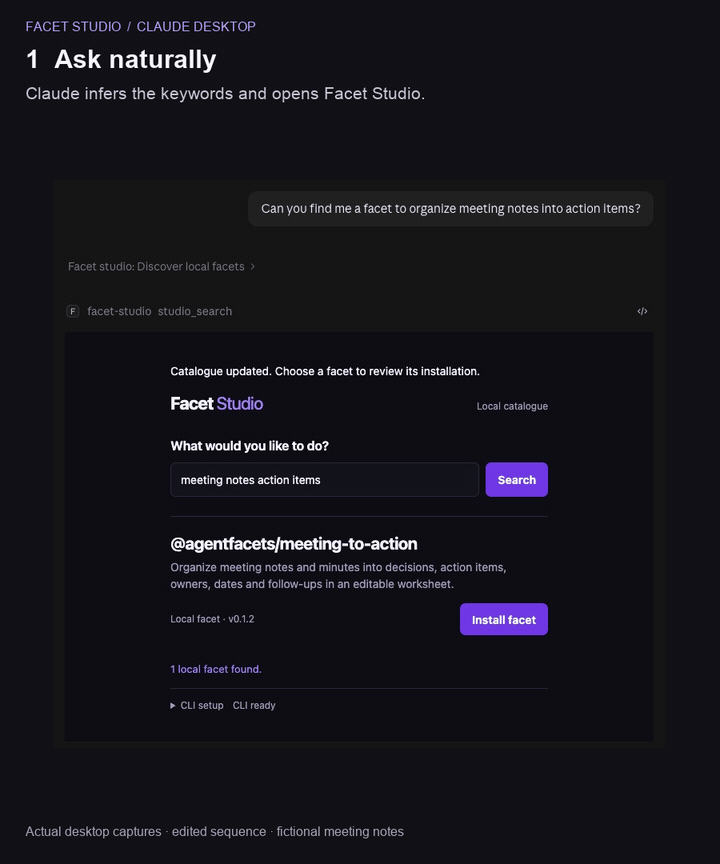

# Example runbook

Run discovery, real package installation, and an interactive meeting worksheet inside one assistant connection. The host assistant supplies the reasoning. CopilotKit owns frontend-tool execution, approval components, and shared state. There is no second model endpoint or nested chat.

Use Claude Desktop for the demonstrated 0.1.1 path. Codex instructions are included, but its new 0.1.1 connection still needs a example walkthrough. The earlier 0.1.0 Codex connection rendered inline and saved an edit; that is not proof of the new approval flow.

## Recording

Animated walkthrough captured from Claude Desktop; pauses shortened.



[Watch or download the MP4 recording](docs/media/meeting-workflow.mp4).

## Prepare from source

You need repository access, Bun, the Facet CLI, and an MCP Apps-capable host. The commands below are for macOS/Linux shells and do not contain a particular developer's paths.

If Bun or Facet is missing, install them using their official installers, then open a fresh terminal:

```sh
curl -fsSL https://bun.sh/install | bash
curl -fsSL https://agentfacets.io/install | bash
```

Clone the private repository with your authorized GitHub account, or start from an existing checkout:

```sh
git clone --branch main https://github.com/agent-facets/facet-studio.git
cd facet-studio
cd examples/cross-desktop
bun --version
facet --version
bun install --frozen-lockfile
bun run build
```

The example is merged into `main`. In an existing checkout, preserve your work before switching to `main` and pulling the latest changes.

Keep this terminal open for the connection steps. Resolve paths from this checkout and create a fresh consuming project:

```sh
export FACET_DEMO_ROOT="$(pwd)"
export FACET_DEMO_BUN="$(command -v bun)"
export FACET_DEMO_PROJECT="$(mktemp -d "${TMPDIR:-/tmp}/facet-studio-demo.XXXXXX")"
printf 'Server: %s\nProject: %s\n' "$FACET_DEMO_ROOT/dist/studio-server.js" "$FACET_DEMO_PROJECT"
facet adapter list
```

At least one compatible adapter must be installed. Choose the relevant one if absent:

```sh
facet adapter add claude-code
# Or, for a Codex-oriented setup:
facet adapter add codex
```

Adapters materialize package files; they do not create the host's MCP connection. Local bundled installation does not require registry login. For the private registry packages, sign in with an account granted access to the `@agentfacets` organization:

```sh
facet login
facet whoami
```

Keep the normal Facet home. Setting `FACET_DIR` to an empty directory hides installed adapters and credentials. No OpenAI or other model API key is required by this prototype.

## Connect Claude Desktop

Generate a configuration fragment with the actual absolute Bun, server, and project paths:

```sh
bun -e 'console.log(JSON.stringify({mcpServers:{"facet-studio-demo":{command:process.env.FACET_DEMO_BUN,args:[process.env.FACET_DEMO_ROOT+"/dist/studio-server.js"],env:{FACET_STUDIO_PROJECT:process.env.FACET_DEMO_PROJECT,PATH:process.env.PATH}}}},null,2))'
```

Merge the printed `facet-studio-demo` entry into the `mcpServers` object in Claude Desktop's local MCP configuration. On macOS the usual file is `~/Library/Application Support/Claude/claude_desktop_config.json`; use the app's developer/configuration controls to locate it. Preserve other server entries. The generated fragment has this shape:

```json
{
  "mcpServers": {
    "facet-studio-demo": {
      "command": "/absolute/path/from/command-v-bun",
      "args": ["/absolute/checkout/examples/cross-desktop/dist/studio-server.js"],
      "env": {
        "FACET_STUDIO_PROJECT": "/absolute/fresh/consuming-project",
        "PATH": "/your/normal/executable/search/path"
      }
    }
  }
}
```

After saving configuration, reconnect the server or fully quit and reopen Claude Desktop if needed. Start a new chat and enable this server. Disable older Studio/Meeting demo connections in that chat so the assistant cannot select an obsolete standalone tool. This setup restart happens once before the demo; installation and opening the meeting app then use the same running connection.

Do not run `bun dist/studio-server.js` in a terminal expecting a web page. It is a stdio MCP process launched by the host.

## Connect Codex

Use the paths exported during source preparation. The CLI writes a stdio MCP entry:

```sh
codex mcp add facet-studio-demo \
  --env "FACET_STUDIO_PROJECT=$FACET_DEMO_PROJECT" \
  --env "PATH=$PATH" \
  -- "$FACET_DEMO_BUN" "$FACET_DEMO_ROOT/dist/studio-server.js"
codex mcp list
```

If that demo name already exists and you intend to replace it, remove only that entry first with `codex mcp remove facet-studio-demo`, then repeat the add command. Reconnect or reopen Codex and start a new task using this server. Rendering happens in an MCP Apps-capable Codex UI; the terminal CLI configuration command does not itself display a card.

Rehearse the entire 0.1.1 flow before relying on Codex for the example. Its earlier 0.1.0 inline/save evidence does not cover the new installation and save approval components.

## Five-minute walkthrough

All names and notes here are fictional.

1. **Discover, about one minute.** Ask the assistant: “Open Facet Studio's local catalogue so I can find a meeting action-plan tool. Use the connected Studio demo.” If it needs an exact entry point, ask it to call `studio_search` with `{"query":"meeting"}`. Type `meeting` into the inline search and click Search. Explain that this is the configured local catalogue, not a public registry search.
2. **Review installation, about one minute.** Click Install on Meeting to Action. In the rendered review component, choose Decline. Nothing is installed. Click Install again, then Approve. This invokes the real Facet CLI. When it finishes, choose Open. If the host puts the Open request in its composer, send it. The installed worksheet opens at Capture notes without restarting the connection.
3. **Use host reasoning, about one minute.** Set the title to `Pilot readiness` and paste the notes below. Choose Ask assistant. Send the plain-language request if it appears in the composer. The host assistant returns an action plan into the worksheet; it may create a new card that opens directly in Review.
4. **Review and save, about one minute.** Confirm Maya's date, Leo's blank date, and the unassigned feedback task. Change Maya to Rae. Choose Save plan, inspect the approval snapshot, and Decline. The local edit remains; no save runs. Choose Save plan again and Approve. Look for “Approved plan saved for this server session.”
5. **Keep the result, about one minute.** Export Markdown. Explain that the downloaded file can be kept and shared, while Save updates this running app session. Reopen the installed app from Studio if you want to demonstrate shared saved state.

```text
Pilot readiness meeting — 8 October 2026.
We agreed to run a small internal pilot before inviting external customers.
Maya will send the pilot checklist by 12 October 2026.
Leo will arrange the internal rehearsal; no date was agreed.
We need to collect feedback after the rehearsal, but no owner or date was assigned.
```

Expected proposal: title `Pilot readiness`, Maya due `2026-10-12`, Leo with an empty due date, and feedback with an empty owner and date. Review the actual result: the host is doing real reasoning, so wording can vary. Do not claim every host response is deterministic.

## How the example works

| Responsibility | Implementation |
|---|---|
| Reasoning | The existing Claude or Codex assistant interprets the notes and calls the installed app through MCP. No second LLM client runs in either UI. |
| Frontend actions | `CopilotKitCoreReact.runTool` invokes handlers registered by `useFrontendTool`. Studio search and approved installation/save execute through these handlers. |
| Human review | `useHumanInTheLoop` owns a pending tool call. Its real renderer exposes Approve/Decline; execution waits for that response. Single-use receipts bind approval to the reviewed input snapshot. |
| Tool components | `useRenderToolCall` renders actual tool-call history and results within the current layout. It is not a second chat window. |
| Shared state | `useAgent` reads the local AG-UI agent. `HostStateAgent` translates real host results into tool lifecycle events and state snapshots. |
| Host transport | MCP Apps provides inline resources, host context, tool calls, model-context updates, and the plain-language message sent to the host. |
| Installed app routing | Studio verifies CLI lock identity and companion bytes, starts the installed child, and uses a predeclared stable bridge so hosts need not refresh their tool list after install. |

Key files, relative to this directory:

| File | Read it for |
|---|---|
| [src/workflow.tsx](src/workflow.tsx) | CopilotKit tools, approval receipts, render components, and `HostStateAgent`. |
| [src/workflow.test.tsx](src/workflow.test.tsx) | Actual mounted hooks and rendered approval buttons; decline, approve, error, cancellation, and no extra model-run checks. |
| [src/studio-ui.tsx](src/studio-ui.tsx) | Studio search, install review, shared catalogue state, and Open handoff. |
| [src/ui.tsx](src/ui.tsx), [src/bridge.ts](src/bridge.ts) | Meeting edits/save approval and host reasoning/context transport. |
| [src/studio-server.ts](src/studio-server.ts), [src/app-proxy.ts](src/app-proxy.ts) | Stable bridge tools and installed child lifecycle. |
| [src/catalog.ts](src/catalog.ts), [src/install.ts](src/install.ts) | Catalogue validation, real CLI installation, and installed companion verification. |
| [scripts/build.ts](scripts/build.ts) | Portable server/UI bundles and the included local catalogue. |

## Private packages and portability

Both versions are private and require organization access:

- [@agentfacets/facet-studio 0.1.1](https://agentfacets.io/facets/@agentfacets/facet-studio)
- [@agentfacets/meeting-to-action 0.1.1](https://agentfacets.io/facets/@agentfacets/meeting-to-action)

The source setup above is the simplest reproducible route. To demonstrate package travel separately, use a fresh project with your normal Facet home:

```sh
export FACET_PACKAGE_PROJECT="$(mktemp -d "${TMPDIR:-/tmp}/facet-package-demo.XXXXXX")"
cd "$FACET_PACKAGE_PROJECT"
facet add @agentfacets/facet-studio@0.1.1
# Optional independent meeting package:
facet add @agentfacets/meeting-to-action@0.1.1
```

The selected adapter materializes `skills/facet-studio/assets/studio-server.js` beneath its output directory, such as `.agents/` or `.opencode/`. Inspect the install output to locate the actual file. An installed Studio host entry points to that absolute companion instead of the source `dist/studio-server.js`. Keep its neighboring HTML, catalogue and nested companion files together. Bun remains required; the source checkout and `node_modules` do not. Avoid changing the working example connection just to show this optional path.

## Reset and recover

**Start a clean demonstration:** export any plan worth keeping, stop/reconnect the demo server, create another project with the `mktemp` command, and update `FACET_STUDIO_PROJECT` in the host entry. For Codex, remove/re-add only the demo entry with the new environment value. For Claude, regenerate and merge the fragment. Start a new chat/task. Changing a shell variable alone does not change an already-running host process. Keeping the old project is safe; no deletion is required.

**Save versus Export:** Save updates the live child server's shared worksheet. It is not a disk-backed plan file. Restarting that server clears its plan even though package installation remains on disk. Export Markdown creates a durable file through the host/browser download flow.

| Symptom | Recovery |
|---|---|
| No inline card | Confirm this is an MCP Apps-capable host UI, the demo server is enabled, and `studio_search` was called. Check host MCP logs for the configured absolute Bun/server paths. CLI text output alone is not a rendering test. |
| Old UI or unknown tool | Disable the old demo connection, reconnect the intended entry, and start a fresh chat. Do not ask the assistant to use an older standalone `meeting_open` connection. |
| Request appears in composer | Send it. The app prepares the host request; it does not promise the host will submit it automatically. |
| Install cannot finish | Run `facet adapter list` and ensure an adapter is installed. Check the consuming directory is writable and the host's PATH includes the CLI. Preserve the normal Facet home. |
| Private package unavailable | Run `facet login` and `facet whoami`; confirm organization membership. Anonymous access is intentionally unavailable. The bundled local catalogue is independent of registry search. |
| Plan disappears after restart | That is session behavior. Use Export Markdown before restarting. |
| Decline left an edit visible | Expected: decline prevents installation or saving, not local editing. Approve a later review to commit the snapshot to the running server session. |

For a partial browser fallback, return to the example directory and run:

```sh
cd "$FACET_DEMO_ROOT"
PORT=4328 bun start
```

Open `http://127.0.0.1:4328`. This shows the same meeting worksheet with sample data, editing, approval/save, and Markdown export. It explicitly lacks host reasoning and is not the full Studio discovery/host-assistant demonstration.

## Rehearsal checklist and limits

- Build from the intended source revision and connect one fresh demo entry.
- Confirm the local catalogue appears, decline one install, then approve and Open.
- Confirm the host proposal preserves missing assignments; decline one save, then approve and Export.

The catalogue is fixed at startup and currently contains one real meeting fixture. Each app has one primary UI. CopilotKit uses the installed SDK's `agents__unsafe_dev_only` registration API; this is prototype integration. Client approval controls the demonstrated UI workflow, not authorization against direct MCP tool calls. The server's path, catalogue and installed-byte checks are separate protections.

The native 0.1.1 Claude sequence above has been exercised, including both decline and approve paths. Codex 0.1.1 visual/interaction rehearsal is still pending. This is a viable local demo with explicit limits, not a claim that every host and deployment configuration is fully tested.
